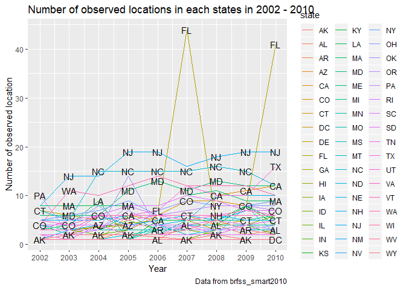
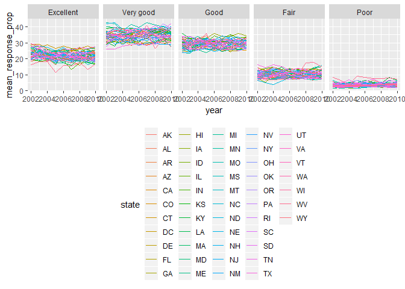
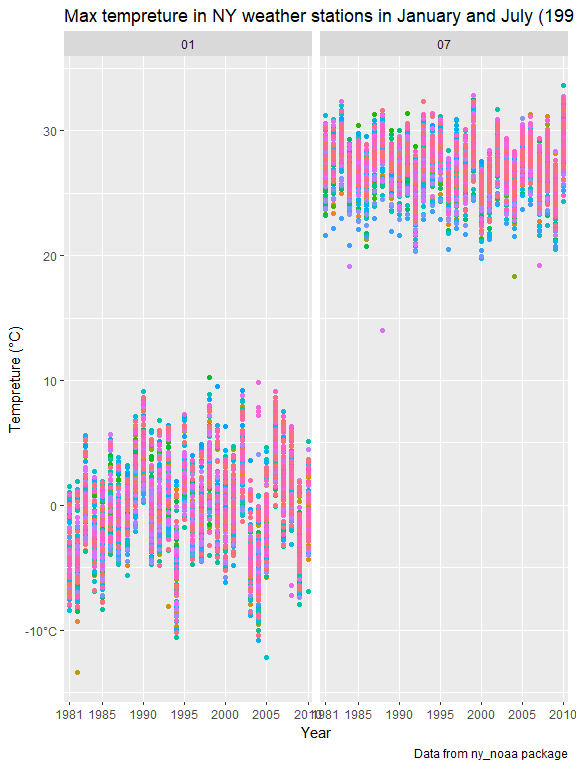

p8105\_hw3\_jy2947
================
Jiawei Ye

### Problem 1

``` r
data("brfss_smart2010")
brfss_smart2010 = 
  janitor::clean_names(brfss_smart2010) %>% 
  filter(topic == "Overall Health") %>% 
  rename(state = locationabbr, location = locationdesc)
brfss_smart2010$response  = factor(brfss_smart2010$response, levels = c("Excellent", "Very good", "Good", "Fair", "Poor"))
```

``` r
brfss_smart2010 %>% 
  filter(year == 2002) %>% 
  group_by(state, location) %>% 
  summarize(n_location = n()) %>% 
  summarize(n_location = n()) %>% 
  filter(n_location == 7)
```

    ## # A tibble: 3 x 2
    ##   state n_location
    ##   <chr>      <int>
    ## 1 CT             7
    ## 2 FL             7
    ## 3 NC             7

Connecticut, Florida, North Carolina were observed at 7 locations.

``` r
brfss_smart2010 %>% 
  select(year, state,location) %>% 
  distinct() %>% 
  group_by(state, year) %>% 
  summarize(n_location = n()) %>% 
  ggplot(aes(x = year, y = n_location)) +
  geom_line(aes(color = state)) +
  labs(
    title = "Number of observed location in each states in 2002 - 2010",
    x = "Year",
    y = "Number of observed location",
    caption = "Data from brfss_smart2010"
  ) +
  scale_x_continuous(breaks = c(2002, 2003, 2004, 2005, 2006, 2007, 
                                2008, 2009, 2010),
                     labels = c("2002", "2003", "2004", "2005", "2006", 
                                "2007", "2008", "2009", "2010"),
                     limits = c(2002,2010)) +
  geom_text(aes(label = state), check_overlap = TRUE)
```



The spaghetti plot shows most states has less than 10 observed location during 2002 - 2010. Florida had more than 40 observed locations in 2007 and 2010, but only had around or less than 10 in other years, which is interesting. New Jersy had around 20 observed locations after 2005.

``` r
brfss_smart2010 %>% 
  select(year, response, state, location, data_value) %>% 
  filter(year == "2002" | year == "2006" | year == "2010", 
         response == "Excellent", state == "NY") %>% 
  group_by(year) %>% 
  summarize(mean_excellent_NY = round(mean(data_value), digits = 1),
            sd_excellent_NY = round(sd(data_value), digits = 1))
```

    ## # A tibble: 3 x 3
    ##    year mean_excellent_NY sd_excellent_NY
    ##   <int>             <dbl>           <dbl>
    ## 1  2002              24               4.5
    ## 2  2006              22.5             4  
    ## 3  2010              22.7             3.6

In NY state about one-fifth people thought their overall health was excellent in 2002, 2006, and 2010. The mean excellent proportion in 2006 and 2010 is about the same, in 2002 it is a bit higher. There is some variance in different location in NY state, but not very much.

``` r
brfss_smart2010 %>% 
  select(year, state, location, response, data_value) %>% 
  group_by(year, state, response) %>% 
  summarise(mean_response_prop = round(mean(data_value), digits = 1)) %>% 
  ggplot(aes(x = year, y = mean_response_prop)) +
  geom_line(aes(color = state)) +
  facet_grid(~response) +
  theme(legend.position = "bottom")
```

    ## Warning: Removed 1 rows containing missing values (geom_path).



``` r
str(brfss_smart2010)
```

    ## Classes 'tbl_df', 'tbl' and 'data.frame':    10625 obs. of  23 variables:
    ##  $ year                      : int  2010 2010 2010 2010 2010 2010 2010 2010 2010 2010 ...
    ##  $ state                     : chr  "AL" "AL" "AL" "AL" ...
    ##  $ location                  : chr  "AL - Jefferson County" "AL - Jefferson County" "AL - Jefferson County" "AL - Jefferson County" ...
    ##  $ class                     : chr  "Health Status" "Health Status" "Health Status" "Health Status" ...
    ##  $ topic                     : chr  "Overall Health" "Overall Health" "Overall Health" "Overall Health" ...
    ##  $ question                  : chr  "How is your general health?" "How is your general health?" "How is your general health?" "How is your general health?" ...
    ##  $ response                  : Factor w/ 5 levels "Excellent","Very good",..: 1 2 3 4 5 1 2 3 4 5 ...
    ##  $ sample_size               : int  94 148 208 107 45 91 177 224 120 66 ...
    ##  $ data_value                : num  18.9 30 33.1 12.5 5.5 15.6 31.3 31.2 15.5 6.4 ...
    ##  $ confidence_limit_low      : num  14.1 24.9 28.2 9.5 3.5 11 26 26.1 11.7 4.4 ...
    ##  $ confidence_limit_high     : num  23.6 35 38 15.4 7.4 20.1 36.5 36.2 19.2 8.3 ...
    ##  $ display_order             : int  1 2 3 4 5 1 2 3 4 5 ...
    ##  $ data_value_unit           : chr  "%" "%" "%" "%" ...
    ##  $ data_value_type           : chr  "Crude Prevalence" "Crude Prevalence" "Crude Prevalence" "Crude Prevalence" ...
    ##  $ data_value_footnote_symbol: chr  NA NA NA NA ...
    ##  $ data_value_footnote       : chr  NA NA NA NA ...
    ##  $ data_source               : chr  "BRFSS" "BRFSS" "BRFSS" "BRFSS" ...
    ##  $ class_id                  : chr  "CLASS08" "CLASS08" "CLASS08" "CLASS08" ...
    ##  $ topic_id                  : chr  "Topic41" "Topic41" "Topic41" "Topic41" ...
    ##  $ location_id               : chr  NA NA NA NA ...
    ##  $ question_id               : chr  "GENHLTH" "GENHLTH" "GENHLTH" "GENHLTH" ...
    ##  $ respid                    : chr  "RESP056" "RESP057" "RESP058" "RESP059" ...
    ##  $ geo_location              : chr  "(33.518601, -86.814688)" "(33.518601, -86.814688)" "(33.518601, -86.814688)" "(33.518601, -86.814688)" ...
    ##  - attr(*, "spec")=List of 2
    ##   ..$ cols   :List of 23
    ##   .. ..$ Year                      : list()
    ##   .. .. ..- attr(*, "class")= chr  "collector_integer" "collector"
    ##   .. ..$ Locationabbr              : list()
    ##   .. .. ..- attr(*, "class")= chr  "collector_character" "collector"
    ##   .. ..$ Locationdesc              : list()
    ##   .. .. ..- attr(*, "class")= chr  "collector_character" "collector"
    ##   .. ..$ Class                     : list()
    ##   .. .. ..- attr(*, "class")= chr  "collector_character" "collector"
    ##   .. ..$ Topic                     : list()
    ##   .. .. ..- attr(*, "class")= chr  "collector_character" "collector"
    ##   .. ..$ Question                  : list()
    ##   .. .. ..- attr(*, "class")= chr  "collector_character" "collector"
    ##   .. ..$ Response                  : list()
    ##   .. .. ..- attr(*, "class")= chr  "collector_character" "collector"
    ##   .. ..$ Sample_Size               : list()
    ##   .. .. ..- attr(*, "class")= chr  "collector_integer" "collector"
    ##   .. ..$ Data_value                : list()
    ##   .. .. ..- attr(*, "class")= chr  "collector_double" "collector"
    ##   .. ..$ Confidence_limit_Low      : list()
    ##   .. .. ..- attr(*, "class")= chr  "collector_double" "collector"
    ##   .. ..$ Confidence_limit_High     : list()
    ##   .. .. ..- attr(*, "class")= chr  "collector_double" "collector"
    ##   .. ..$ Display_order             : list()
    ##   .. .. ..- attr(*, "class")= chr  "collector_integer" "collector"
    ##   .. ..$ Data_value_unit           : list()
    ##   .. .. ..- attr(*, "class")= chr  "collector_character" "collector"
    ##   .. ..$ Data_value_type           : list()
    ##   .. .. ..- attr(*, "class")= chr  "collector_character" "collector"
    ##   .. ..$ Data_Value_Footnote_Symbol: list()
    ##   .. .. ..- attr(*, "class")= chr  "collector_character" "collector"
    ##   .. ..$ Data_Value_Footnote       : list()
    ##   .. .. ..- attr(*, "class")= chr  "collector_character" "collector"
    ##   .. ..$ DataSource                : list()
    ##   .. .. ..- attr(*, "class")= chr  "collector_character" "collector"
    ##   .. ..$ ClassId                   : list()
    ##   .. .. ..- attr(*, "class")= chr  "collector_character" "collector"
    ##   .. ..$ TopicId                   : list()
    ##   .. .. ..- attr(*, "class")= chr  "collector_character" "collector"
    ##   .. ..$ LocationID                : list()
    ##   .. .. ..- attr(*, "class")= chr  "collector_character" "collector"
    ##   .. ..$ QuestionID                : list()
    ##   .. .. ..- attr(*, "class")= chr  "collector_character" "collector"
    ##   .. ..$ RESPID                    : list()
    ##   .. .. ..- attr(*, "class")= chr  "collector_character" "collector"
    ##   .. ..$ GeoLocation               : list()
    ##   .. .. ..- attr(*, "class")= chr  "collector_character" "collector"
    ##   ..$ default: list()
    ##   .. ..- attr(*, "class")= chr  "collector_guess" "collector"
    ##   ..- attr(*, "class")= chr "col_spec"

For most states, 30% - 40% people think their overall health is very good, but not excellent in 2002 - 2010. Less than 10% people thinks their overall health is poor. Generally speaking the majority of people thinks their health status is good or better.

### Problem 2

``` r
data("instacart")
```

The data has information of some orders from customers, which includes the product information

-   the product names ordered by customers
-   the department of the product ordered by custormers
-   where is the product located in the inventory
-   has this product been reordered by this customer

and information about (what I define as) customer behavior

-   at what time of the day was the order placed
-   in what order was the products added into the cart
-   how often does the customer order from instacart

The key variables are `order_id` (which identifies each order), `product_id`(which identifies each item perchased by a user) and `user_id`(which identifies the user).
For example, row 1 to row 8 is a order placed by customer with the `user_id` 112108, each row is a product ordered by this custormer. This user mainly perchased diary and produce for daily comsumption, along with a bottle of canned seafood. This user order his(her) groceries at 10am. His(her) last order on instacard was 9 days ago, and he(she) has ordered some of the products before. This dataset has 1384617 rows and 15 variables.

To answer the questions:

``` r
instacart %>% 
  group_by(aisle, aisle_id) %>% 
  summarize(n_aisle = n()) %>% 
  arrange(desc(n_aisle))
```

    ## # A tibble: 134 x 3
    ## # Groups:   aisle [134]
    ##    aisle                         aisle_id n_aisle
    ##    <chr>                            <int>   <int>
    ##  1 fresh vegetables                    83  150609
    ##  2 fresh fruits                        24  150473
    ##  3 packaged vegetables fruits         123   78493
    ##  4 yogurt                             120   55240
    ##  5 packaged cheese                     21   41699
    ##  6 water seltzer sparkling water      115   36617
    ##  7 milk                                84   32644
    ##  8 chips pretzels                     107   31269
    ##  9 soy lactosefree                     91   26240
    ## 10 bread                              112   23635
    ## # ... with 124 more rows

So we have 134 aisles. People are ordering the most item from fresh vegetables, with `aisle_id = 83`.

\`\`\`{r first\_plot}
=====================

instacart %&gt;% filter(department == "alcohol") %&gt;% group\_by(aisle) %&gt;% summarize(n\_aisle = n()) %&gt;% ggplot(aes(x = aisle, y = n\_aisle)) + geom\_point(aes(color = aisle)) \#doesn't work instacart %&gt;% group\_by(aisle, department) %&gt;% summarize(n\_aisle = n(), n\_department = n()) %&gt;% ggplot(aes(x = aisle, y = n\_aisle)) + geom\_point(alpha = 0.5)

ggplot(aes(x = department, y = n\_department)) + geom\_point(aes()) + facet\_wrap(~ department) \#\`\`\`

for the first plot the idea now is to have several panels for different departments.(No idea how to work that out for now) Within each department try the histogram(histogram requires the X-axis data to be continuous, so might use geom\_col/ or just points) for each aisle.

### Problem 3

``` r
data("ny_noaa")
ny_noaa = 
  janitor::clean_names(ny_noaa)
```

This dataset contains some information of weather at different locations in the US. It has 2595176 observations and 7 variables. It identifies a place by the id, and have information about the max and min temperature, percipitation, snow and snwd *w**h**a**t**i**s**t**h**i**s* on a specific day from 1993 to 2010. There are lot of data missing.

``` r
ny_noaa = 
  separate(ny_noaa, date, into = c("year", "month", "day")) %>% 
  mutate(prcp_mm = ifelse(is.na(prcp), NA, prcp / 10),
         tmax_c  = ifelse(is.na(tmax), NA, as.numeric(tmax) / 10),
         tmin_c  = ifelse(is.na(tmin), NA, as.integer(tmin) / 10)) %>%
  rename(snow_mm = snow, sn_depth_mm = snwd) %>% 
  select(-prcp, -tmax, -tmin)

ny_noaa %>% 
  group_by(snow_mm) %>% 
  summarise(n_snowfall = n()) %>% 
  arrange(desc(n_snowfall))
```

    ## # A tibble: 282 x 2
    ##    snow_mm n_snowfall
    ##      <int>      <int>
    ##  1       0    2008508
    ##  2      NA     381221
    ##  3      25      31022
    ##  4      13      23095
    ##  5      51      18274
    ##  6      76      10173
    ##  7       8       9962
    ##  8       5       9748
    ##  9      38       9197
    ## 10       3       8790
    ## # ... with 272 more rows

The most frequent value for `snowfall` is 0, which means it is not snowing in the location on that day.

``` r
knitr::opts_chunk$set(
  fig.width = 20,
  fig.height = 20
)
max_temp =
  ny_noaa %>% 
  select(id,year, month, snow_mm, tmax_c) %>% 
  filter(month == "01" | month == "07") %>% 
  group_by(year,id, month) %>% 
  summarise(mean_max = round(mean(tmax_c, na.rm = TRUE), digits = 1)) %>%
  filter(!is.na(mean_max))

ggplot(max_temp, aes(x = year, y = mean_max)) + 
  geom_boxplot(aes(color = id)) +
  labs(
#    title = "Max tempreture in NY weather stations in January and July (1991-2010)", 
    y = "Tempreture (°C)", 
    x = "Year",
    caption = "Data from ny_noaa package") +
  scale_x_discrete(breaks = c(1981, 1985, 1990, 1995, 2000, 2005, 2010),
                     labels = c("1981", "1985", "1990", "1995", "2000", "2005", "2010")) +
  scale_y_continuous(breaks = c(-10, 0, 10, 20, 30),
                     labels = c("-10°C", "0", "10", "20", "30")) +
  theme(legend.position = "none") +
  facet_grid(~month)
```



ny\_noaa = filter(ny\_noaa, !is.na(snow), !is.na(snwd), !is.na(tmax), !is.na(tmin)) ny\_noaa %&gt;%
group\_by(id) %&gt;% summarize(n\_id = n()) ny\_noaa = filter(ny\_noaa, id == "USC00300023" | id == "USC00300093" | id == "USC00300331") ny\_noaa %&gt;% select(id, tmax, tmin) %&gt;% gather(key = observation, value = temp, tmax:tmin)
