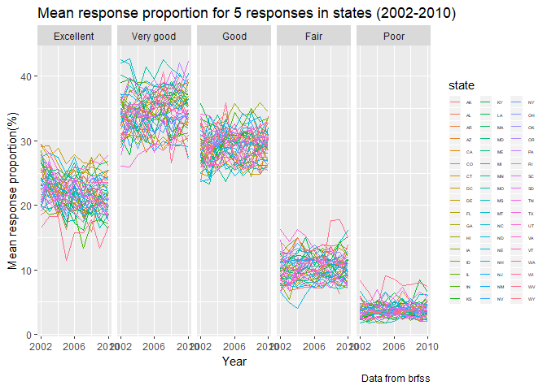
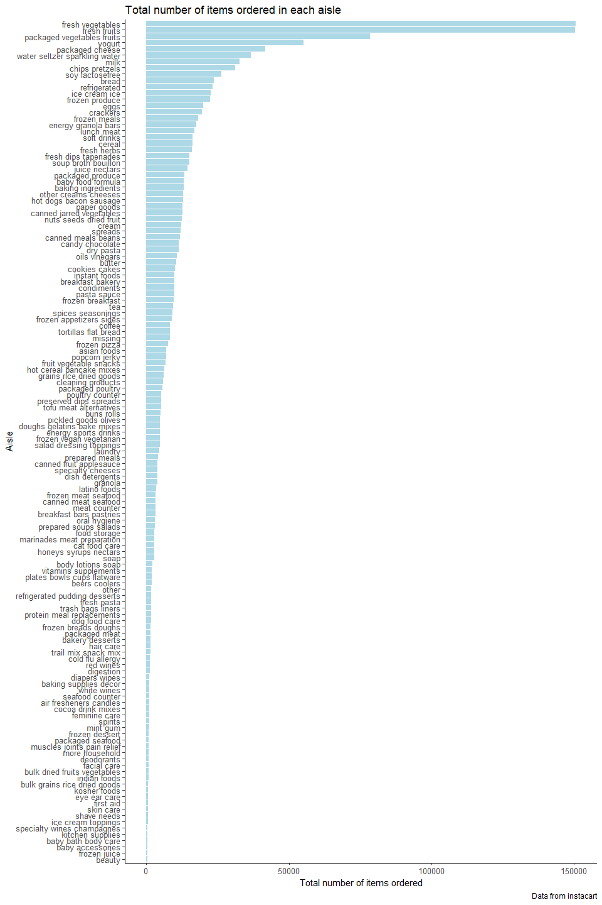

p8105\_hw3\_jy2947
================
Jiawei Ye

### Problem 1

Load the data, filter the data of interest, some cleaning.

``` r
data("brfss_smart2010")
brfss_smart2010 = 
  janitor::clean_names(brfss_smart2010) %>% 
  filter(topic == "Overall Health") %>% 
  rename(state = locationabbr, location = locationdesc)
brfss_smart2010$response  = factor(brfss_smart2010$response, 
                                   levels = c("Excellent", "Very good", "Good", "Fair", "Poor"))
```

``` r
brfss_smart2010 %>% 
  filter(year == 2002) %>% 
  group_by(state, location) %>% 
  summarize(n_location = n()) %>% 
  summarize(n_location = n()) %>% 
  filter(n_location == 7)
```

    ## # A tibble: 3 x 2
    ##   state n_location
    ##   <chr>      <int>
    ## 1 CT             7
    ## 2 FL             7
    ## 3 NC             7

Connecticut, Florida, North Carolina were observed at 7 locations.

``` r
brfss_smart2010 %>% 
  select(year, state,location) %>% 
  distinct() %>% 
  group_by(state, year) %>% 
  summarize(n_location = n()) %>% 
  ggplot(aes(x = year, y = n_location)) +
  geom_line(aes(color = state)) +
  labs(
    title = "Number of observed locations in each states in 2002 - 2010",
    x = "Year",
    y = "Number of observed location",
    caption = "Data from brfss_smart2010"
  ) +
  scale_x_continuous(breaks = c(2002, 2003, 2004, 2005, 2006, 2007, 
                                2008, 2009, 2010),
                     labels = c("2002", "2003", "2004", "2005", "2006", 
                                "2007", "2008", "2009", "2010"),
                     limits = c(2002,2010)) +
  geom_text(aes(label = state), check_overlap = TRUE)
```


The spaghetti plot shows most states has less than 10 observed location during 2002 - 2010. Florida had more than 40 observed locations in 2007 and 2010, but only had around or less than 10 in other years, which is interesting. New Jersy ranked the second and had around 20 observed locations after 2005.

``` r
brfss_smart2010 %>% 
  select(year, response, state, location, data_value) %>% 
  filter(year == "2002" | year == "2006" | year == "2010", 
         response == "Excellent", state == "NY") %>% 
  group_by(year) %>% 
  summarize(mean_excellent_NY = round(mean(data_value), digits = 1),
            sd_excellent_NY = round(sd(data_value), digits = 1)) %>% 
  kable()
```

|  year|  mean\_excellent\_NY|  sd\_excellent\_NY|
|-----:|--------------------:|------------------:|
|  2002|                 24.0|                4.5|
|  2006|                 22.5|                4.0|
|  2010|                 22.7|                3.6|

In NY state about one-fifth people thought their overall health was excellent in 2002, 2006, and 2010. The mean excellent proportion in 2006 and 2010 is about the same, in 2002 it is a bit higher. There is some variance in different location in NY state, but not very much.

``` r
brfss_smart2010 %>% 
  select(year, state, location, response, data_value) %>% 
  group_by(year, state, response) %>% 
  summarise(mean_response_prop = round(mean(data_value), digits = 1)) %>% 
  ggplot(aes(x = year, y = mean_response_prop)) +
  geom_line(aes(color = state)) +
  scale_x_continuous(breaks = c(2002, 2006, 2010),
                   labels = c("2002", "2006", "2010")) +
  labs(title = "Mean response proportion for 5 responses in states (2002-2010)",
       x = "Year",
       y = "Mean response proportion(%)",
       caption = "Data from brfss") +
  
  facet_grid(~response) +
  theme(legend.position = "right",
        legend.text = element_text(size = 4),
        legend.key.size = unit(0.4, "cm"))
```

    ## Warning: Removed 1 rows containing missing values (geom_path).



For most states, 30% - 40% people think their overall health is very good, but not excellent in 2002 - 2010. Less than 10% people thinks their overall health is poor. Generally speaking the majority of people thinks their health status is good or better.

### Problem 2

``` r
data("instacart")
```

The data has information of some orders from customers, which includes product information:

-   the product names ordered by customers
-   the department of the product ordered by custormers
-   where is the product located in the inventory
-   has this product been reordered by this customer

and information about (what I define as) customer behavior:

-   at what time of the day was the order placed
-   in what order was the products added into the cart
-   how often does the customer order from instacart

This dataset has 1384617 rows and 15 variables. The key variables are `order_id` (which identifies each order), `product_id`(which identifies each item perchased by a user) and `user_id`(which identifies the user).
For example, row 1 to row 8 is a order placed by customer with the `user_id` 112108, each row is a product ordered by this custormer. This user mainly perchased diary and produce for daily comsumption, along with a bottle of canned seafood. This user order his(her) groceries at 10am. His(her) last order on instacard was 9 days ago, and he(she) has ordered some of the products before.

To answer the questions:

``` r
instacart %>% 
  group_by(aisle, aisle_id) %>% 
  summarize(n_aisle = n()) %>% 
  arrange(desc(n_aisle))
```

    ## # A tibble: 134 x 3
    ## # Groups:   aisle [134]
    ##    aisle                         aisle_id n_aisle
    ##    <chr>                            <int>   <int>
    ##  1 fresh vegetables                    83  150609
    ##  2 fresh fruits                        24  150473
    ##  3 packaged vegetables fruits         123   78493
    ##  4 yogurt                             120   55240
    ##  5 packaged cheese                     21   41699
    ##  6 water seltzer sparkling water      115   36617
    ##  7 milk                                84   32644
    ##  8 chips pretzels                     107   31269
    ##  9 soy lactosefree                     91   26240
    ## 10 bread                              112   23635
    ## # ... with 124 more rows

So we have 134 aisles. People are ordering the most item from fresh vegetables, with `aisle_id = 83`.

``` r
instacart %>%  
  group_by(aisle) %>% 
  summarize(n_aisle = n()) %>% 
  arrange(desc(n_aisle)) %>%
  ggplot(aes(x = reorder(aisle, n_aisle), y = n_aisle)) +
  geom_col() +
  labs(title = "Total number of items ordered in each aisle", 
       x = "Aisle",
       y = "Total number of items ordered",
       caption = "Data from instacart") +
  theme_classic() +
  theme(legend.position = "none") +
  coord_flip()
```



``` r
instacart %>% 
  filter(aisle == "baking ingredients" |
         aisle == "dog food care" |
         aisle == "packaged vegetables fruits") %>%
  group_by(aisle, product_name) %>% 
  summarise(item_count = n()) %>% 
  arrange(desc(item_count)) %>% 
  top_n(1, item_count)
```

    ## # A tibble: 3 x 3
    ## # Groups:   aisle [3]
    ##   aisle                  product_name                           item_count
    ##   <chr>                  <chr>                                       <int>
    ## 1 packaged vegetables f~ Organic Baby Spinach                         9784
    ## 2 baking ingredients     Light Brown Sugar                             499
    ## 3 dog food care          Snack Sticks Chicken & Rice Recipe Do~         30

``` r
instacart %>% 
  filter(product_name == "Pink Lady Apples" |
         product_name == "Coffee Ice Cream") %>% 
  group_by(product_name, order_dow) %>% 
  summarise(mean_hour = round(mean(order_hour_of_day), digits = 1)) %>%
  spread(order_dow, mean_hour) %>% 
  rename(Sunday = "0", Monday = "1", Tuesday = "2", 
         Wednesday = "3", Thursday = "4", Friday = "5", Saturday = "6")
```

    ## # A tibble: 2 x 8
    ## # Groups:   product_name [2]
    ##   product_name     Sunday Monday Tuesday Wednesday Thursday Friday Saturday
    ##   <chr>             <dbl>  <dbl>   <dbl>     <dbl>    <dbl>  <dbl>    <dbl>
    ## 1 Coffee Ice Cream   13.8   14.3    15.4      15.3     15.2   12.3     13.8
    ## 2 Pink Lady Apples   13.4   11.4    11.7      14.2     11.6   12.8     11.9

### Problem 3

``` r
data("ny_noaa")
ny_noaa = 
  janitor::clean_names(ny_noaa)
```

This dataset contains some information of weather at different locations in the US. It has 2595176 observations and 7 variables. It identifies a place by the id, and have information about the max and min temperature, percipitation, snow and snwd *w**h**a**t**i**s**t**h**i**s* on a specific day from 1993 to 2010. There are lot of data missing.

``` r
ny_noaa = 
  separate(ny_noaa, date, into = c("year", "month", "day")) %>% 
  mutate(prcp_mm = ifelse(is.na(prcp), NA, prcp / 10),
         tmax_c  = ifelse(is.na(tmax), NA, as.numeric(tmax) / 10),
         tmin_c  = ifelse(is.na(tmin), NA, as.integer(tmin) / 10)) %>%
  rename(snow_mm = snow, sn_depth_mm = snwd) %>% 
  select(-prcp, -tmax, -tmin)

ny_noaa %>% 
  group_by(snow_mm) %>% 
  summarise(n_snowfall = n()) %>% 
  arrange(desc(n_snowfall))
```

    ## # A tibble: 282 x 2
    ##    snow_mm n_snowfall
    ##      <int>      <int>
    ##  1       0    2008508
    ##  2      NA     381221
    ##  3      25      31022
    ##  4      13      23095
    ##  5      51      18274
    ##  6      76      10173
    ##  7       8       9962
    ##  8       5       9748
    ##  9      38       9197
    ## 10       3       8790
    ## # ... with 272 more rows

The most frequent value for `snowfall` is 0, which means it is not snowing in the location on that day.

``` r
knitr::opts_chunk$set(
  fig.width = 20,
  fig.height = 20
)
max_temp =
  ny_noaa %>% 
  select(id,year, month, snow_mm, tmax_c) %>% 
  filter(month == "01" | month == "07") %>% 
  group_by(year,id, month) %>% 
  summarise(mean_max = round(mean(tmax_c, na.rm = TRUE), digits = 1)) %>%
  filter(!is.na(mean_max))

ggplot(max_temp, aes(x = year, y = mean_max)) + 
  geom_point(aes(color = id)) +
  labs(
#    title = "Max tempreture in NY weather stations in January and July (1991-2010)", 
    y = "Tempreture (°C)", 
    x = "Year",
    caption = "Data from ny_noaa package") +
  scale_x_discrete(breaks = c(1981, 1985, 1990, 1995, 2000, 2005, 2010),
                     labels = c("1981", "1985", "1990", "1995", "2000", "2005", "2010")) +
  scale_y_continuous(breaks = c(-10, 0, 10, 20, 30),
                     labels = c("-10°C", "0", "10", "20", "30")) +
  theme(legend.position = "none") +
  facet_grid(~month)
```


``` r
tmax_min = 
  ggplot(ny_noaa, aes(x = tmin_c, y = tmax_c)) +
  geom_bin2d() +
  labs(title = "Tempreture in NY in 1981 - 2010", 
       x = "Minimun tempreture(°C)", 
       y = "Maximum tempreture(°C)") +
  theme_classic() +
  theme(legend.position = c(0.95, 0.3))

snowfall =
  ny_noaa %>% 
    filter(snow_mm > 0 & snow_mm < 100) %>% 
    ggplot(aes(x = snow_mm)) +
    geom_density(aes(color = year), alpha = 0.05) +
    labs(title = "Distribution of snowfall between 0 and 100 by year", 
         x = "Snowfall (mm)", 
         y = "Distribution",
         caption = "Data from ny_noaa") +
    theme_classic() +
    theme(legend.position = c(0.9, 0.65),
          legend.key.size = unit(0.1, "cm"), 
          legend.text = element_text(size = 7),
          legend.direction = "vertical")
    
tmax_min/snowfall
```

    ## Warning: Removed 1136276 rows containing non-finite values (stat_bin2d).


